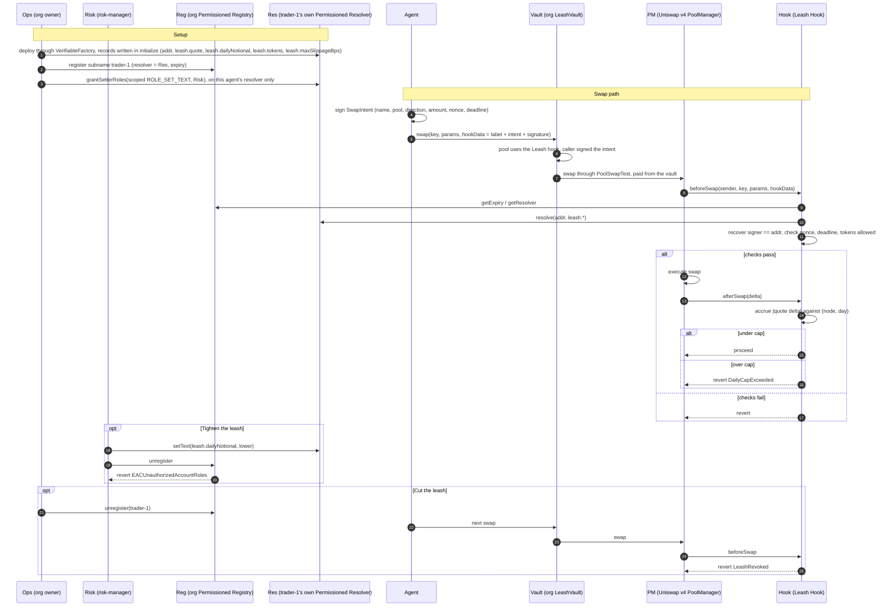

# Leash

**ENS-native permissions for autonomous traders. Name your agent, bound it, revoke it.**

A Uniswap v4 hook that gates every swap on the trading agent's ENSv2 subname and on the risk policy stored in that agent's own Permissioned Resolver.

## Live on Sepolia

**Dashboard: [leash-omega.vercel.app/app](https://leash-omega.vercel.app/app)**. Every value on it is read from Sepolia, nothing is hard coded (the RPC is in the footer). The owner and risk-manager cards sign with a connected wallet.

The org is **`leash.eth`** on the ENSv2 beta, and its agent is **`trader-1.leash.eth`**, resolved by its own Permissioned Resolver: a daily cap in lUSD, lUSD and lETH allowed, a max slippage per swap, a mandate that ends on 2026-10-26. The risk manager and the owner change these records during the demo, so the dashboard shows the current values rather than this page.

Per agent delegation, live: **`trader-4.leash.eth`** was issued without the risk manager's role. Open its tab on the dashboard and click **Tighten the leash** on the risk-manager card: the write is simulated and ENS refuses it, `EACUnauthorizedAccountRoles`, with nothing sent and no wallet needed. The same click on `trader-1` is a real transaction the risk manager may sign.

Contract addresses and how to check it yourself: [Deployed on Sepolia](#deployed-on-sepolia). The Uniswap v4 hook, line by line: [Where the Uniswap v4 integration lives](FEEDBACK.md#where-the-uniswap-v4-integration-lives). Every agent owns its ENSv2 resolver: [One Permissioned Resolver per agent](#one-permissioned-resolver-per-agent).

---

## The problem

DAOs, treasuries and trading desks are handing private keys to bots and AI agents. Today that delegation is all or nothing:

* The key holds full authority over whatever the account can touch.
* If the key leaks, or the agent misbehaves, the treasury leaves in one block.
* Revocation means rotating keys and redeploying infrastructure, not flipping a switch.

There is no onchain answer to a simple question: *is this address still allowed to trade on our behalf, and within what limits?*

## The idea

Leash turns an ENS name into the agent's credential, and a Uniswap v4 hook into the enforcement point.

1. The organisation owns `leash.eth` and deploys its own **Permissioned Registry**.
2. Each agent is issued a revocable subname with an expiry: `trader-1.leash.eth`. Every agent is its own name in the org's namespace, with its own identity (the `addr` record), its own limits (text records) and its own mandate end (the expiry).
3. **Every agent gets its own Permissioned Resolver**, deployed by the org with the agent's policy written in the same transaction, and the subname points to it. The agent owns its data: its resolver holds its records and nobody else's. The agent address is the name's native `addr` record, and the daily notional cap, allowed tokens and maximum price impact per swap are text records, `leash.quote`, `leash.dailyNotional`, `leash.tokens` and `leash.maxSlippageBps`.
4. **Enhanced Access Control** lets a `risk-manager` role hold `ROLE_SET_TEXT` scoped to just the `leash.dailyNotional` and `leash.tokens` keys, granted on one agent's resolver: never the name itself, nor the owner-only `leash.maxSlippageBps`, nor any other agent. An agent can be issued with no risk manager at all. Only the owner can revoke that role, agent by agent.
5. The agent signs an EIP-712 `SwapIntent` (name, pool, direction, amount, nonce, deadline). `hookData` carries the label, the intent and the signature. A **Uniswap v4 hook** recovers the signer and compares it to the name's `addr` record: `beforeSwap` checks identity and the token allowlist, `afterSwap` counts the real quote token delta against the daily cap. No trusted router, any Uniswap v4 router works.

6. The agent holds no tokens. The org's **vault** does: it only trades on pools gated by the Leash hook, only for the agent that signed the intent, and only the owner can withdraw. A leaked agent key can at worst trade inside the mandate.

Revoking the subname is an instant kill switch. No key rotation, no redeploy, one transaction.

## Flow



## Run it

Needs [foundry](https://getfoundry.sh), [bun](https://bun.sh) and [Claude Code](https://claude.com/claude-code) (`claude` on the PATH). Copy `.env.example` to `.env`, set `SEPOLIA_RPC_URL` and three fresh keys from `cast wallet new` (`OWNER_PK`, `RISK_MANAGER_PK`, `AGENT_PK`).

```bash
git submodule update --init --recursive
forge build && forge test
(cd agent && bun install) && (cd dashboard && bun install)
```

### Demo in four terminals

```bash
script/demo.sh anvil            # 1. anvil fork of Sepolia (real ENSv2 and Uniswap v4 contracts)
script/demo.sh setup            # 2. one shot, about a minute: registers leash.eth, deploys the org registry,
                                #    resolver, hook, pool and org vault, issues trader-1.leash.eth with its policy
script/demo.sh dashboard        # 3. http://localhost:5173/app?label=trader-1 (setup already synced the record)
script/demo.sh agent            # 4. Claude Code as trader-1, with only the leash_policy and leash_swap tools
```

Then, side by side:

1. In the agent terminal: `buy 25 lUSD of lETH`. The dashboard's activity feed shows the signed intent and the swap, the leash bar moves to 10 percent.
2. Agent terminal: `buy 300 lUSD of lETH`. The agent tries, the hook answers `DailyCapExceeded`, nothing moves.
   Optional: dashboard, owner card, set max slippage to 5 bps. `buy 100 lUSD of lETH` is partially filled at the price limit, asking for 0.5% slippage reverts `SlippageTooLoose`.
3. Dashboard, risk-manager card: set the cap to 10 and click **tighten the leash**. Click **try to revoke**: every attempt reverts with `EACUnauthorizedAccountRoles`.
4. Dashboard, owner card: **cut the leash**. Status flips to REVOKED. Ask the agent to trade again: `LeashRevoked`.
5. Dashboard, **+ New agent** tab: issue `trader-2` with its own resolver, cap, slippage and expiry. Owner transactions: its own Permissioned Resolver with the policy written in `initialize`, the name pointing to it, then (optional checkbox) the risk manager's role on that resolver. Leave **Give the risk manager its role** unticked, and the risk manager can still tighten `trader-1` but not `trader-2`: on `trader-2`, **tighten the leash** is simulated first and the risk-manager card shows ENS refusing, `EACUnauthorizedAccountRoles`, without sending anything (no wallet needed to watch it). Every name the org issued gets its own tab, read from the registry's `LabelRegistered` events; a cut one stays greyed at the end, with **Re-issue**. Agent terminal: `buy 20 lUSD of lETH as trader-2`, and the hook enforces the new mandate. All agents trade from the one org vault shown above the tabs (**Fund vault** mints more test tokens into it).

The same acts run against the live Sepolia deployment: prefix any command with `LEASH_NETWORK=sepolia` (for instance `LEASH_NETWORK=sepolia script/demo.sh agent`), and start the dashboard with `LEASH_NETWORK=sepolia script/demo.sh dashboard` to keep the owner and risk-manager controls. `LEASH_NETWORK=sepolia script/demo.sh deploy` is the one shot live deployment. Add `LEASH_RECORD_REFUSALS=1` in front of the agent command to send refused orders anyway through the vault's `trySwap`: each refusal is recorded on chain as a `SwapRefused` event with the hook's reason, and shows in the dashboard's on-chain activity (the agent pays about 0.0004 ETH of Sepolia gas per refusal).

Step by step script with expected output: [docs/demo.md](docs/demo.md). Reset between runs: restart `script/demo.sh anvil`, run `setup` again (it also clears the dashboard feed), reload the dashboard.

## Why ENSv2 and Uniswap v4 are the product, not decoration

Leash is two halves that need each other: ENSv2 says who may trade and within what limits, Uniswap v4 enforces it on the swap itself.

**ENSv2 holds the mandate**

| Primitive | Role in Leash |
|---|---|
| Permissioned Registry | The org's own namespace, issuing and revoking agent identities |
| Subname expiry | Time-boxed mandates that lapse on their own |
| Name token held by the org | The agent only appears in the `addr` record: it trades under its name, but can neither transfer it, renew it nor edit its own policy |
| Permissioned Resolver, one per agent | Each agent owns its data: its policy lives in its own resolver, readable onchain by the hook and by any ENS client |
| Enhanced Access Control | Per agent, per record key delegation: the risk desk edits `trader-1`'s `leash.dailyNotional`, never the name, never another agent |

**Uniswap v4 enforces it**

| Primitive | Role in Leash |
|---|---|
| Hooks | A pool created with the Leash hook cannot be swapped without it: every trade goes through the checks, whoever routes it |
| `beforeSwap` | Recovers the intent's signer and compares it to the name's `addr` record, checks the token allowlist and that `sqrtPriceLimitX96` stays within `leash.maxSlippageBps` |
| `hookData` | Carries the agent's EIP-712 signed intent, so the hook ignores `msg.sender`: any v4 router works, no trusted router |
| `afterSwap` and `BalanceDelta` | The daily cap counts the real settled quote token amount, not a quoted or claimed one |

Strip ENS out and the policy has nowhere to live: the design collapses into a bespoke allowlist contract. Strip Uniswap v4 out and nothing enforces the policy at the moment of the trade: you are back to a trusted router, or a bot promising to behave. Leash passes both tests.

### One Permissioned Resolver per agent

Every agent owns its data: the org deploys a dedicated ENSv2 Permissioned Resolver for each agent it issues, and the agent's subname points to it.

* **Created with its policy.** `VerifiableFactory.deployProxy` creates the resolver and writes `addr` and the `leash.*` records in `initialize`, in one transaction; `register` then points the name to it. See [`script/ens/IssueAgent.s.sol`](script/ens/IssueAgent.s.sol) and the dashboard's **+ New agent** tab ([`dashboard/src/lib/actions.ts`](dashboard/src/lib/actions.ts), `issueCalls`).
* **Delegation per agent.** The resolver scopes Enhanced Access Control roles per record key. One resolver per agent turns the risk manager's `ROLE_SET_TEXT` on `leash.dailyNotional` and `leash.tokens` into a right on that one agent ([`script/ens/GrantRiskManager.s.sol`](script/ens/GrantRiskManager.s.sol)). An agent can run with no risk manager, and revoking the role on one agent leaves the others alone.
* **The demo shows it.** In **+ New agent**, issue `trader-2` without ticking **Give the risk manager its role**. The risk manager tightens `trader-1` as before; on `trader-2`, **tighten the leash** is simulated before anything is signed, and the card answers `Refused by ENS, nothing sent: EACUnauthorizedAccountRoles`. The Onchain facts of each agent say whether the risk manager holds a role on its resolver.
* **Nothing to change in the hook.** It already asks the org registry for each name's resolver on every swap (`getResolver(label)`), so every agent's own resolver is read the moment the name points to it.
* **Migrated live.** `trader-1` and `trader-2` started on a resolver shared by the org. [`script/ens/MigrateAgentResolver.s.sol`](script/ens/MigrateAgentResolver.s.sol) copied each one's records into its own resolver and re-pointed the name with `setResolver`, keeping its token and expiry: for `trader-1`, [deploy](https://sepolia.etherscan.io/tx/0xd772cca1340f4faabdc98c8fec7e9947908eceba49b899244296306d3d94321e), [re-point](https://sepolia.etherscan.io/tx/0xc6502fb240156c9d04eb70c5e1fdef4baf361580e71f4f862c30464e9323d628), [risk manager grant](https://sepolia.etherscan.io/tx/0x381bdac709adf7e9d543e6e73d1194c5102c69e1b5cf7ce228d532551aaba14b).
* **Tested on the real contracts.** [`test/fork/EnsSetup.t.sol`](test/fork/EnsSetup.t.sol) runs against the Sepolia ENSv2 deployment: each agent gets a distinct resolver holding only its records, a risk manager with no grant on an agent reverts `EACUnauthorizedAccountRoles`, a revoke on one agent keeps the grant on another, a name moves to a fresh resolver with its expiry kept, and the `UniversalResolver` resolves the agent through its own resolver.

Developer feedback on Uniswap v4 and ENSv2: [FEEDBACK.md](FEEDBACK.md).

## Trust model

* The hook trusts the org registry address and the parent name it was deployed with.
* It trusts the resolver that registry points each name to (the agent's own), nothing else.
* It trusts the `addr` record of the name as the agent's identity.
* It trusts EIP-712 signatures over a `SwapIntent`, with a nonce per name.
* It trusts the daily cap as measured in quote token units, from the real settlement delta in `afterSwap`.

The vault trusts the hook it was deployed with, and the router it swaps through. Its owner is the only one who can move funds out.

Every agent has its own resolver, so a risk-manager's role covers the agents it was granted on and no other: an org can give each desk its own agents, or issue an agent with no risk manager at all.

## Vocabulary

* **leash**: the subname issued to an agent
* **leash length**: the policy records bounding it
* **cut the leash**: revoke the subname, killing the agent mid-flight

## Deployed on Sepolia

| Contract | Address | |
|---|---|---|
| `LeashHook` (Uniswap v4 hook) | [`0x8c1f16B42C75190316636a956A4C85F8D1c440c0`](https://sepolia.etherscan.io/address/0x8c1f16B42C75190316636a956A4C85F8D1c440c0#code) | verified |
| `LeashVault` (org treasury the agents trade from, records refusals) | [`0xF585aB28733dEB745105f4d8F960c4CcE4bC025B`](https://sepolia.etherscan.io/address/0xF585aB28733dEB745105f4d8F960c4CcE4bC025B#code) | verified |
| Previous `LeashVault`, before `trySwap` (empty, funds moved) | [`0x3Ee1b2a02CA8a87572B6d172913Db37bd3C37022`](https://sepolia.etherscan.io/address/0x3Ee1b2a02CA8a87572B6d172913Db37bd3C37022#code) | verified |
| lUSD, the quote token (`token0`) | [`0x3EC79AB413c942159218358dfb6EB83Fa1F59C4E`](https://sepolia.etherscan.io/address/0x3EC79AB413c942159218358dfb6EB83Fa1F59C4E#code) | verified |
| lETH (`token1`) | [`0x9E63305f38825e126BBD7A9582a53bd516431C02`](https://sepolia.etherscan.io/address/0x9E63305f38825e126BBD7A9582a53bd516431C02#code) | verified |
| Org Permissioned Registry of `leash.eth` | [`0xe614c0f0D9Ce98Aaf986Fce5f5Ef46614DF64fE9`](https://sepolia.etherscan.io/address/0xe614c0f0D9Ce98Aaf986Fce5f5Ef46614DF64fE9) | ENS `VerifiableFactory` proxy |
| Own Permissioned Resolver of `trader-1.leash.eth` (its policy records) | [`0x084976Ed9Ca1ac81057250F3A5aB4a40B2f98ee8`](https://sepolia.etherscan.io/address/0x084976Ed9Ca1ac81057250F3A5aB4a40B2f98ee8) | ENS `VerifiableFactory` proxy |
| Own Permissioned Resolver of `trader-2.leash.eth` | [`0xA0CA8bC1a9903B536e492e1DBd5C1E1c56D10b4d`](https://sepolia.etherscan.io/address/0xA0CA8bC1a9903B536e492e1DBd5C1E1c56D10b4d) | ENS `VerifiableFactory` proxy |
| Own Permissioned Resolver of `trader-4.leash.eth`, no risk manager role | [`0x14D1c39BEa9A2a60784e0f0dC6b28CAc4459D23D`](https://sepolia.etherscan.io/address/0x14D1c39BEa9A2a60784e0f0dC6b28CAc4459D23D) | ENS `VerifiableFactory` proxy |
| Previous resolver, shared by the agents before each got its own | [`0x5112C1F6bF910DC0B127BE2B109Dc484168c668F`](https://sepolia.etherscan.io/address/0x5112C1F6bF910DC0B127BE2B109Dc484168c668F) | ENS `VerifiableFactory` proxy |
| ENSv2 `.eth` registry (holds `leash.eth`) | [`0x657eA849311d3D5823348ddEd7C2AaAFb3EDE09E`](https://sepolia.etherscan.io/address/0x657eA849311d3D5823348ddEd7C2AaAFb3EDE09E) | ENS |
| Uniswap v4 PoolManager | [`0xE03A1074c86CFeDd5C142C4F04F1a1536e203543`](https://sepolia.etherscan.io/address/0xE03A1074c86CFeDd5C142C4F04F1a1536e203543) | Uniswap |

| Role | Address |
|---|---|
| Owner (holds `leash.eth`, cuts the leash) | [`0x703c9e946882859A749B704AFde861D47ED4f8c2`](https://sepolia.etherscan.io/address/0x703c9e946882859A749B704AFde861D47ED4f8c2) |
| Risk manager (may only edit `leash.dailyNotional` and `leash.tokens`) | [`0x1045752bA6d1D88C6B97Ae91A3da6b91F4790E47`](https://sepolia.etherscan.io/address/0x1045752bA6d1D88C6B97Ae91A3da6b91F4790E47) |
| Agent `trader-1.leash.eth` (signs intents, holds only gas ETH) | [`0xA162DbFfd5c4171Fb7058FEAa7a28F5c63C44A0d`](https://sepolia.etherscan.io/address/0xA162DbFfd5c4171Fb7058FEAa7a28F5c63C44A0d) |

Pool: lUSD/lETH, fee 3000, tick spacing 60, id `0x74e548ef341b71b902f9f0b6ff76c3897c1b40201540b9b2ab418338ae75db32`. The full record is [`deployments/sepolia.json`](deployments/sepolia.json).

**Check it yourself**

1. On the hook's [Read Contract](https://sepolia.etherscan.io/address/0x8c1f16B42C75190316636a956A4C85F8D1c440c0#readContract) tab, call `policy("trader-1")`. It returns the agent address, quote token, cap, allowed tokens and expiry, read live from the ENS resolver. `remainingToday("trader-1")` and `maxSlippageBps("trader-1")` work the same way.
2. Resolve the name like any ENS client, through the ENSv2 `UniversalResolverV2` on Sepolia, without going through Leash (`0x0874…6800` is `trader-1.leash.eth`, DNS encoded):

   ```bash
   cast call 0x5d25c1d6acbb71b7a28aa7899618a3412a8303e3 "resolve(bytes,bytes)(bytes,address)" 0x087472616465722d31056c656173680365746800 $(cast calldata "addr(bytes32)" $(cast namehash trader-1.leash.eth)) --rpc-url https://ethereum-sepolia-rpc.publicnode.com
   ```

   It returns the agent's address and `trader-1`'s own resolver `0x0849…8ee8`. The policy reads the same way, here the daily cap:

   ```bash
   cast call 0x5d25c1d6acbb71b7a28aa7899618a3412a8303e3 "resolve(bytes,bytes)(bytes,address)" 0x087472616465722d31056c656173680365746800 $(cast calldata "text(bytes32,string)" $(cast namehash trader-1.leash.eth) leash.dailyNotional) --rpc-url https://ethereum-sepolia-rpc.publicnode.com | head -1 | xargs cast abi-decode "f()(string)"
   ```
3. An agent swap, [`0xe289a614…c55857`](https://sepolia.etherscan.io/tx/0xe289a614c9614923730a1abf8ca3794149a01bf9a0f96926bbda652ac0c55857): the agent calls the vault, the vault pays 5 lUSD, and the hook emits `LeashSwap` with the spend counted against the cap.
4. A refused order, recorded on chain, [`0x42dd5f63…f00bc2`](https://sepolia.etherscan.io/tx/0x42dd5f635dc8c680249e776cadb65177396c6754e9dabd286e2193696df00bc2): the agent asked for 500 lUSD over a 100 lUSD cap through the vault's `trySwap`. The transaction succeeds, nothing moves, and the vault emits `SwapRefused` carrying the hook's `DailyCapExceeded` error. The dashboard's activity feed decodes it.
5. The agent's address holds no lUSD and no lETH: the tokens sit in the vault, which only trades on pools gated by the hook, and only the owner can withdraw from it.
6. On the dashboard, **Try to revoke** simulates the risk manager calling `unregister`, `setAddress` and the owner-only records. Each call reverts with `EACUnauthorizedAccountRoles`, the ENSv2 Enhanced Access Control error.
7. On the dashboard, the **Onchain** facts of each agent show its **own resolver** and whether the risk manager holds a role on it. The **On chain** activity feed shows `trader-1.leash.eth moved to its own resolver 0x0849…8ee8`. On Etherscan, the resolver's [events](https://sepolia.etherscan.io/address/0x084976Ed9Ca1ac81057250F3A5aB4a40B2f98ee8#events) hold `trader-1`'s records only.
