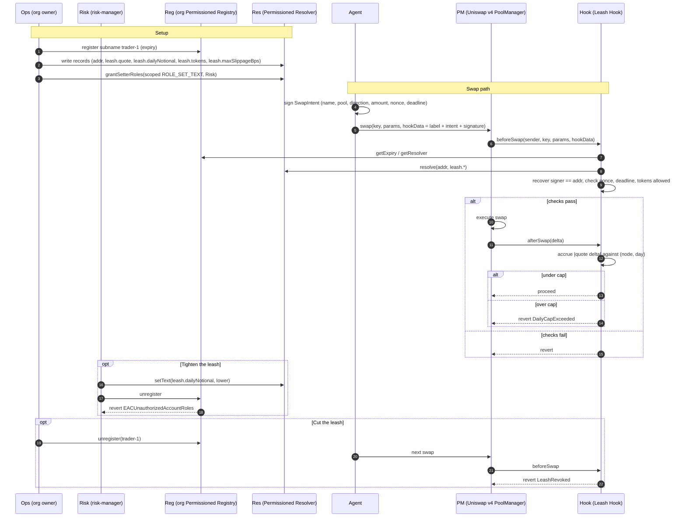

# Leash

**ENS-native permissions for autonomous traders. Name your agent, bound it, revoke it.**

A Uniswap v4 hook that gates every swap on the trading agent's ENSv2 subname and on the risk policy stored in that name's resolver.

---

## The problem

DAOs, treasuries and trading desks are handing private keys to bots and AI agents. Today that delegation is all or nothing:

* The key holds full authority over whatever the account can touch.
* If the key leaks, or the agent misbehaves, the treasury leaves in one block.
* Revocation means rotating keys and redeploying infrastructure, not flipping a switch.

There is no onchain answer to a simple question: *is this address still allowed to trade on our behalf, and within what limits?*

## The idea

Leash turns an ENS name into the agent's credential, and a Uniswap v4 hook into the enforcement point.

1. The organisation owns `acme.eth` and deploys its own **Permissioned Registry**.
2. Each agent is issued a revocable subname with an expiry: `trader-1.acme.eth`.
3. The agent's risk policy lives in its **Permissioned Resolver**: the agent address is the name's native `addr` record, and the daily notional cap, allowed tokens and maximum price impact per swap are text records, `leash.quote`, `leash.dailyNotional`, `leash.tokens` and `leash.maxSlippageBps`.
4. **Enhanced Access Control** lets a `risk-manager` role hold `ROLE_SET_TEXT` scoped to just the `leash.dailyNotional` and `leash.tokens` keys, never the name itself, nor the owner-only `leash.maxSlippageBps`. Only the owner can revoke that role.
5. The agent signs an EIP-712 `SwapIntent` (name, pool, direction, amount, nonce, deadline). `hookData` carries the label, the intent and the signature. A **Uniswap v4 hook** recovers the signer and compares it to the name's `addr` record: `beforeSwap` checks identity and the token allowlist, `afterSwap` counts the real quote token delta against the daily cap. No trusted router, any Uniswap v4 router works.

Revoking the subname is an instant kill switch. No key rotation, no redeploy, one transaction.

## Flow



## Run it

Needs [foundry](https://getfoundry.sh), [bun](https://bun.sh) and [Claude Code](https://claude.com/claude-code) (`claude` on the PATH). Copy `.env.example` to `.env`, set `SEPOLIA_RPC_URL` and three fresh keys from `cast wallet new` (`OWNER_PK`, `RISK_MANAGER_PK`, `AGENT_PK`).

```bash
git submodule update --init --recursive
forge build && forge test
(cd agent && bun install) && (cd dashboard && bun install)
```

### Demo in four terminals

```bash
script/demo.sh anvil            # 1. anvil fork of Sepolia (real ENSv2 and Uniswap v4 contracts)
script/demo.sh setup            # 2. one shot, about a minute: registers leashdemo.eth, deploys the org registry,
                                #    resolver, hook and pool, issues trader-1.leashdemo.eth with its policy
cd dashboard && bun run dev    # 3. http://localhost:5173/?label=trader-1 (setup already synced the record)
script/demo.sh agent            # 4. Claude Code as trader-1, with only the leash_policy and leash_swap tools
```

Then, side by side:

1. In the agent terminal: `buy 25 lUSD of lETH`. The dashboard's activity feed shows the signed intent and the swap, the leash bar moves to 10 percent.
2. Agent terminal: `buy 300 lUSD of lETH`. The agent tries, the hook answers `DailyCapExceeded`, nothing moves.
3. Dashboard, risk-manager card: set the cap to 10 and click **tighten the leash**. Click **try to revoke**: every attempt reverts with `EACUnauthorizedAccountRoles`.
4. Dashboard, owner card: **cut the leash**. Status flips to REVOKED. Ask the agent to trade again: `LeashRevoked`.

Step by step script with expected output: [docs/demo.md](docs/demo.md). Reset between runs: restart `script/demo.sh anvil`, run `setup` again (it also clears the dashboard feed), reload the dashboard.

## Why ENSv2 is the product, not decoration

| Primitive | Role in Leash |
|---|---|
| Permissioned Registry | The org's own namespace, issuing and revoking agent identities |
| Subname expiry | Time-boxed mandates that lapse on their own |
| Permissioned Resolver | Where the risk policy actually lives, readable onchain by the hook |
| Enhanced Access Control | Per record key delegation: the risk desk edits `leash.dailyNotional`, never the name |

Strip ENS out and the design collapses into a bespoke allowlist contract. That is the test it passes.

## Trust model

* The hook trusts the org registry address and the parent name it was deployed with.
* It trusts the resolver that registry points to, nothing else.
* It trusts the `addr` record of the name as the agent's identity.
* It trusts EIP-712 signatures over a `SwapIntent`, with a nonce per name.
* It trusts the daily cap as measured in quote token units, from the real settlement delta in `afterSwap`.

One resolver per org means a risk-manager's cap change applies to every agent name that resolver serves, not just one.

## Vocabulary

* **leash**: the subname issued to an agent
* **leash length**: the policy records bounding it
* **cut the leash**: revoke the subname, killing the agent mid-flight
